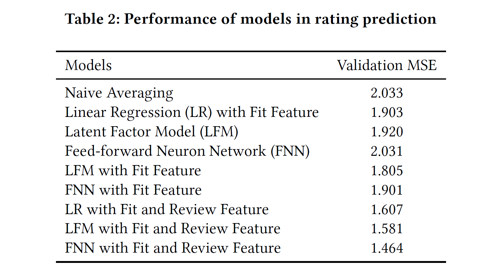

# Rating and fit prediction on RentTheRunWay dataset

This is the project of Web Mining and Recommender Systems course at UCSD. Rating and fit prediction with different models on RentTheRunWay dataset are conducted. Models are implemented with sklearn library and PyTorch.

## Acknowledgement
The dataset is provided by Prof. Julian McAuley at https://cseweb.ucsd.edu/~jmcauley/datasets.html.

## Single sample of dataset
Each sample in this dataset is a dict like the one below. 
{ 
  &ensp; "fit": "fit", 
  &ensp; "user_id": "420272", 
  &ensp; "bust size": "34d", 
  &ensp; "item_id": "2260466", 
  &ensp; "weight": "137lbs", 
  &ensp; "rating": "10", 
  &ensp; "rented for": "vacation", 
  &ensp; "review_text": "An adorable romper! Belt and zipper were a little hard to navigate in a full day of wear/bathroom use, but  
  &ensp;&ensp;&ensp;&ensp;&ensp;&ensp; that's to be expected. Wish it had pockets, but other than that-- absolutely perfect! I got a million compliments.", 
  &ensp; "body type": "hourglass", 
  &ensp; "review_summary": "So many compliments!", 
  &ensp; "category": "romper", 
  &ensp; "height": "5' 8\"", 
  &ensp; "size": 14, 
  &ensp; "age": "28", 
  &ensp; "review_date": "April 20, 2016" 
} 

## Rating Prediction
Naive averaging, linear regression, ensemble of latent factor model and linear regression and shadow dense feed-forward neuron network are implemented and tested on the dataset. The performance of differet model are shown in the table below.

## Fit Prediction
Logistic regression, SVM, random forest and gradient boosting are implemented and tested on the dataset. The performance of differet model are shown in the table below.

## Detail
The detail of RentTheRunWay dataset and implementation can be seen in our PDF report.
